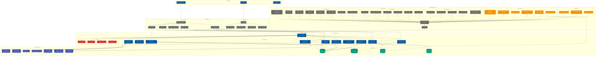

```mermaid
graph TB
    %% Main User Types
    subgraph "User Roles"
        Customer["Customer User"]
        Shop["Shop/Individual User"]
        Admin["Admin User"]
    end

    %% Frontend Applications
    subgraph "Mobile Application"
        UI["UI/UX Layer<br>(Clean & Professional Design)"]
        State["State Management<br>(Redux)"]
        APIClient["API Client"]
        
        subgraph "Core Features"
            Auth["Authentication<br>(OTP + Email)"]
            
            subgraph "Location Services"
                NormalMode["Normal Mode<br>(Manual Location)"]
                LiveMode["Live Tracking Mode<br>(Real-time)"]
                Maps["Maps & Navigation<br>(Google Maps)"]
                Indoor3D["3D Indoor Navigation<br>(Mall Floor Plans)"]
                VoiceNav["Voice Navigation"]
                CrowdDensity["Crowd Density Indicator"]
            end
            
            subgraph "Offer Management"
                OfferBrowsing["Offer Browsing"]
                OfferFiltering["Category/Location Filtering"]
                TimeDeals["Time-bound Deals"]
                EventOffers["Event-Based Offers"]
                EmergencyOffers["Emergency Offers"]
                LiveAuctions["Live Deal Auctions"]
            end
            
            subgraph "Orders & Payments"
                Checkout["Checkout Process"]
                PaymentIntegration["Payment Processing"]
                PreOrder["Pre-Order for Pickup"]
                DeliveryIntegration["Delivery Integration"]
            end
            
            Notifications["Multi-channel Notifications<br>(Push, SMS, WhatsApp)"]
        end
        
        subgraph "Advanced Features"
            AI_Chatbot["AI Chatbot<br>(Personalized Recommendations)"]
            PriceComparison["AI-Powered Price Comparison"]
            AR["Virtual Try-On (AR)"]
            Affiliate["Affiliate Program & Rewards"]
            Reviews["Reviews & Ratings<br>(with Photo Upload)"]
            MultiLanguage["Multi-language Support"]
        end
        
        subgraph "Monetization"
            PremiumSub["Premium Subscriptions"]
            InAppAds["In-App Ads & Sponsored Listings"]
            BrandCollabs["Brand Collaborations"]
        end
    end
    
    %% Backend Services
    subgraph "Backend Services"
        APIGateway["API Gateway<br>(Secure & Scalable)"]
        
        subgraph "Microservices"
            UserService["User Service<br>(Registration & Profiles)"]
            OfferService["Offer Service<br>(Products & Deals)"]
            OrderService["Order Service<br>(Reservations & Purchases)"]
            PaymentService["Payment Service<br>(Secure Processing)"]
            LocationService["Location Service<br>(Geospatial Data)"]
            NotificationService["Notification Service<br>(Multi-channel)"]
            AnalyticsService["Analytics Service<br>(User & Business Insights)"]
            AffiliateService["Affiliate Service<br>(Referrals & Rewards)"]
            AIService["AI Recommendation Service"]
            AuctionService["Auction Service<br>(Real-time Bidding)"]
        end
        
        subgraph "Data Layer"
            MongoDB[(MongoDB<br>Main Database)]
            Redis[(Redis<br>Caching & Real-time)]
            S3[(AWS S3<br>Media Storage)]
            ElasticSearch[(ElasticSearch<br>Fast Searching)]
        end
        
        subgraph "Security Layer"
            OTPVerification["OTP Verification"]
            DataEncryption["Data Encryption"]
            PaymentSecurity["PCI DSS Compliance"]
            APIAuthentication["API Authentication"]
        end
    end
    
    %% Third-Party Integrations
    subgraph "Third-Party Services"
        GoogleMaps["Google Maps API<br>(with Indoor Maps)"]
        PaymentGateways["Payment Gateways<br>(Stripe/PayPal)"]
        SMSProvider["SMS Provider"]
        WhatsApp["WhatsApp Business API"]
        PushNotification["Push Notification<br>Service (Firebase)"]
        Analytics["Analytics Platform<br>(Mixpanel/Amplitude)"]
        DeliveryPartners["Delivery Partners<br>(Uber Eats, etc.)"]
    end
    
    %% Dashboards
    subgraph "Dashboards"
        subgraph "Shop Dashboard"
            ShopUI["Shop Management UI"]
            OfferManagement["Offer Management"]
            OrderTracking["Order Tracking"]
            SalesAnalytics["Sales Analytics"]
            CustomerInsights["Customer Demographics"]
            RevenueTrends["Revenue Trends"]
        end
        
        subgraph "Admin Dashboard"
            AdminUI["Admin UI"]
            UserManagement["User Management"]
            ContentModeration["Content Moderation"]
            SystemMonitoring["System Monitoring"]
            BusinessIntelligence["Business Intelligence"]
        end
    end
    
    %% Connections - Users to App
    Customer --> UI
    Shop --> ShopUI
    Admin --> AdminUI
    
    %% Frontend Internal Connections
    UI <--> State
    State <--> APIClient
    
    %% Core Features Connections
    Auth <--> State
    NormalMode <--> State
    LiveMode <--> State
    Maps <--> State
    Indoor3D <--> State
    VoiceNav <--> State
    CrowdDensity <--> State
    OfferBrowsing <--> State
    OfferFiltering <--> State
    TimeDeals <--> State
    EventOffers <--> State
    EmergencyOffers <--> State
    LiveAuctions <--> State
    Checkout <--> State
    PaymentIntegration <--> State
    PreOrder <--> State
    DeliveryIntegration <--> State
    Notifications <--> State
    
    %% Advanced Features Connections
    AI_Chatbot <--> State
    PriceComparison <--> State
    AR <--> State
    Affiliate <--> State
    Reviews <--> State
    MultiLanguage <--> State
    
    %% Monetization Connections
    PremiumSub <--> State
    InAppAds <--> State
    BrandCollabs <--> State
    
    %% Frontend to Backend
    APIClient <--> APIGateway
    ShopUI <--> APIGateway
    AdminUI <--> APIGateway
    
    %% Backend Internal Connections
    APIGateway <--> UserService
    APIGateway <--> OfferService
    APIGateway <--> OrderService
    APIGateway <--> PaymentService
    APIGateway <--> LocationService
    APIGateway <--> NotificationService
    APIGateway <--> AnalyticsService
    APIGateway <--> AffiliateService
    APIGateway <--> AIService
    APIGateway <--> AuctionService
    
    %% Security Layer Connections
    APIGateway <--> OTPVerification
    APIGateway <--> DataEncryption
    APIGateway <--> PaymentSecurity
    APIGateway <--> APIAuthentication
    
    %% Services to Data Layer
    UserService <--> MongoDB
    OfferService <--> MongoDB
    OrderService <--> MongoDB
    PaymentService <--> MongoDB
    LocationService <--> MongoDB
    NotificationService <--> MongoDB
    AnalyticsService <--> MongoDB
    AffiliateService <--> MongoDB
    AIService <--> MongoDB
    AuctionService <--> MongoDB
    
    LocationService <--> ElasticSearch
    OfferService <--> ElasticSearch
    
    UserService <--> Redis
    OfferService <--> Redis
    LocationService <--> Redis
    AuctionService <--> Redis
    
    OfferService <--> S3
    UserService <--> S3
    Reviews <--> S3
    
    %% Backend to Third-Party
    LocationService <--> GoogleMaps
    PaymentService <--> PaymentGateways
    NotificationService <--> SMSProvider
    NotificationService <--> WhatsApp
    NotificationService <--> PushNotification
    AnalyticsService <--> Analytics
    OrderService <--> DeliveryPartners
    
    %% Shop Dashboard Connections
    ShopUI <--> OfferManagement
    ShopUI <--> OrderTracking
    ShopUI <--> SalesAnalytics
    ShopUI <--> CustomerInsights
    ShopUI <--> RevenueTrends
    
    OfferManagement <--> OfferService
    OrderTracking <--> OrderService
    SalesAnalytics <--> AnalyticsService
    CustomerInsights <--> AnalyticsService
    RevenueTrends <--> AnalyticsService
    
    %% Admin Dashboard Connections
    AdminUI <--> UserManagement
    AdminUI <--> ContentModeration
    AdminUI <--> SystemMonitoring
    AdminUI <--> BusinessIntelligence
    
    UserManagement <--> UserService
    ContentModeration <--> OfferService
    SystemMonitoring <--> APIGateway
    BusinessIntelligence <--> AnalyticsService
    
    %% Styling
    classDef primary fill:#0053a0,stroke:#0053a0,color:white,stroke-width:2px
    classDef secondary fill:#666666,stroke:#666666,color:white
    classDef highlight fill:#f29100,stroke:#f29100,color:white,stroke-width:2px
    classDef database fill:#009688,stroke:#009688,color:white,stroke-width:2px
    classDef external fill:#3f51b5,stroke:#3f51b5,color:white
    classDef security fill:#d32f2f,stroke:#d32f2f,color:white,stroke-width:2px
    
    class Customer,Shop,Admin primary
    class UI,State,APIClient secondary
    class Auth,NormalMode,LiveMode,Maps,Indoor3D,VoiceNav,CrowdDensity,OfferBrowsing,OfferFiltering,TimeDeals,EventOffers,EmergencyOffers,LiveAuctions,Checkout,PaymentIntegration,PreOrder,DeliveryIntegration,Notifications secondary
    class AI_Chatbot,PriceComparison,AR,Affiliate,Reviews,MultiLanguage highlight
    class PremiumSub,InAppAds,BrandCollabs highlight
    class APIGateway,UserService,OfferService,OrderService,PaymentService,LocationService,NotificationService,AnalyticsService,AffiliateService,AIService,AuctionService primary
    class MongoDB,Redis,S3,ElasticSearch database
    class OTPVerification,DataEncryption,PaymentSecurity,APIAuthentication security
    class GoogleMaps,PaymentGateways,SMSProvider,WhatsApp,PushNotification,Analytics,DeliveryPartners external
    class ShopUI,OfferManagement,OrderTracking,SalesAnalytics,CustomerInsights,RevenueTrends secondary
    class AdminUI,UserManagement,ContentModeration,SystemMonitoring,BusinessIntelligence secondary
```
` ` ` `
